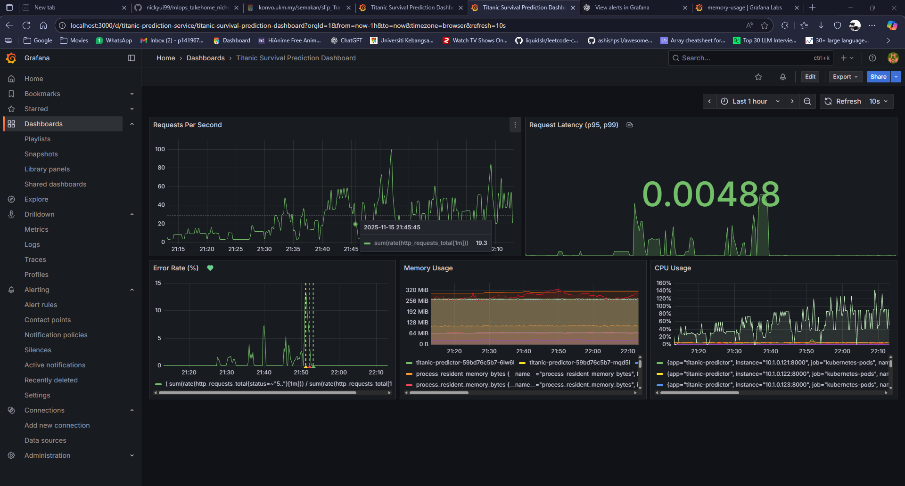

# MLOps Take-Home: Titanic Survival Predictor

[](https://youtu.be/ICTzep0wrCk)
[](https://github.com/nickyui99/mlops_takehome_nicholas/actions/workflows/ci.yml)
[](https://github.com/nickyui99/mlops_takehome_nicholas/pkgs/container/titanic-predictor)
[](https://www.python.org/downloads/)
[](https://github.com/nickyui99/mlops_takehome_nicholas)
[](https://opensource.org/licenses/MIT)

Production-ready ML system demonstrating end-to-end MLOps practices with load balancing, orchestration, CI/CD, and observability.

## 📋 Table of Contents
- [MLOps Take-Home: Titanic Survival Predictor](#mlops-take-home-titanic-survival-predictor)
  - [📋 Table of Contents](#-table-of-contents)
  - [🎯 Overview](#-overview)
  - [🏗️ Architecture](#️-architecture)
  - [📁 Repository Structure](#-repository-structure)
  - [🚀 Quick Start](#-quick-start)
    - [Prerequisites](#prerequisites)
  - [✅ Required Capabilities](#-required-capabilities)
    - [A) Load Balancer (must-have)](#a-load-balancer-must-have)
    - [B) Orchestration](#b-orchestration)
      - [1. Service Orchestration (Docker Compose)](#1-service-orchestration-docker-compose)
      - [2. ML Pipeline Orchestration (Apache Airflow)](#2-ml-pipeline-orchestration-apache-airflow)
    - [C) CI/CD (GitHub Actions)](#c-cicd-github-actions)
      - [1. **CI/CD Pipeline** (`.github/workflows/ci.yml`)](#1-cicd-pipeline-githubworkflowsciyml)
      - [2. **Deploy to Dev** (`.github/workflows/deploy-dev.yml`)](#2-deploy-to-dev-githubworkflowsdeploy-devyml)
      - [3. **Promote to Production** (`.github/workflows/promote-prod.yml`)](#3-promote-to-production-githubworkflowspromote-prodyml)
    - [D) Observability (Grafana + Prometheus)](#d-observability-grafana--prometheus)
    - [Grafana Dashboard Example](#grafana-dashboard-example)
  - [E) Model Tracking / Monitoring](#e-model-tracking--monitoring)
  - [F) Traffic \& Security](#f-traffic--security)
  - [G) State \& Metadata](#g-state--metadata)
  - [H) Cost \& Scalability](#h-cost--scalability)
  - [I) Rollback](#i-rollback)
  - [🎯 Advanced Deployment Strategies](#-advanced-deployment-strategies)
    - [Canary Deployment](#canary-deployment)
      - [Quick Start: Canary Deployment](#quick-start-canary-deployment)
      - [Canary Rollback (If Issues Detected)](#canary-rollback-if-issues-detected)
    - [Blue-Green Deployment](#blue-green-deployment)
      - [Quick Start: Blue-Green Deployment](#quick-start-blue-green-deployment)
      - [Blue-Green Rollback (If Issues Detected)](#blue-green-rollback-if-issues-detected)
    - [Strategy Comparison](#strategy-comparison)
    - [Deployment Workflow Recommendations](#deployment-workflow-recommendations)
      - [Production Deployment Pipeline](#production-deployment-pipeline)
      - [Automated Rollback Triggers](#automated-rollback-triggers)
    - [Complete Demo Scripts](#complete-demo-scripts)
      - [Full Canary Deployment Demo](#full-canary-deployment-demo)
      - [Full Blue-Green Deployment Demo](#full-blue-green-deployment-demo)
  - [🧪 Testing](#-testing)
    - [1. CI Unit Tests (GitHub Actions)](#1-ci-unit-tests-github-actions)
    - [2. Integration Tests (Docker/K8s)](#2-integration-tests-dockerk8s)
    - [3. Load Balancer Tests (`tests/test_lb.py` \& `tests/test_lb_proper.py`)](#3-load-balancer-tests-teststest_lbpy--teststest_lb_properpy)
    - [4. Traffic Generation Tests (`tests/test_traffic.py`)](#4-traffic-generation-tests-teststest_trafficpy)
    - [Running All Tests](#running-all-tests)
    - [Test Environment Setup](#test-environment-setup)
  - [📄 License](#-license)

## 🎯 Overview

This project implements a complete MLOps pipeline for a Titanic survival prediction model, addressing all required capabilities:

✅ **Load Balancer** - NGINX reverse proxy distributing traffic across replicas  
✅ **Orchestration** - Docker Compose / Kubernetes with 3-replica deployment  
✅ **CI/CD** - GitHub Actions for automated testing and deployment  
✅ **Observability** - Prometheus + Grafana monitoring stack  
✅ **Model Tracking** - **MLflow for experiment tracking, model versioning, and registry**  
✅ **Traffic & Security** - Input validation, health checks, proper error handling  
✅ **State & Metadata** - PostgreSQL for prediction logging  
✅ **Cost & Scalability** - Resource limits, horizontal scaling ready  
✅ **Rollback** - Version-tagged Docker images with rollback capability  

**Model Details**: Logistic Regression trained on Titanic dataset (78-82% accuracy). Predicts passenger survival based on class, sex, age, family size, fare, and embarkation port. See [MODEL_CARD.md](MODEL_CARD.md) for full details.

## 🏗️ Architecture

```
                                    ┌──────────────────────────┐
                                    │   GitHub Actions CI/CD   │
                                    │  (Build, Test, Deploy)   │
                                    └────────────┬─────────────┘
                                                 │
┌─────────────┐    ┌──────────────┐    ┌───────┴───────────┐
│   Client    │───▶│     NGINX    │───▶│     FastAPI       │
│             │    │Load Balancer │    │   (3 replicas)    │
└─────────────┘    └──────────────┘    └───────┬───────────┘
                                               │
                    ┌──────────────────────────┼────────────────────────┐
                    ▼                          ▼                        ▼
              ┌──────────┐              ┌───────────┐            ┌──────────┐
              │PostgreSQL│              │  MLflow   │            │Prometheus│
              │(Pred Log)│              │  Server   │            │(Metrics) │
              └──────────┘              │(Model Reg)│            └────┬─────┘
                                        │(Artifacts)│                 │
                                        └─────┬─────┘                 │
                    ┌─────────────────────────┴─────────────┬─────────┘
                    ▼                                       ▼
              ┌──────────┐                            ┌─────────┐
              │ Airflow  │                            │ Grafana │
              │(Pipeline)│                            │(Dashbrd)│
              └──────────┘                            └─────────┘
```

**Key Components**:
- **NGINX**: Reverse proxy with load balancing across 3 API replicas
- **FastAPI**: Prediction service with health checks and metrics
- **PostgreSQL**: Persistent storage for prediction logs and metadata
- **MLflow**: Complete ML lifecycle management (tracking, registry, artifacts)
- **Airflow**: Workflow orchestration for training pipelines
- **Prometheus**: Metrics collection and alerting
- **Grafana**: Monitoring dashboards and visualization
- **GitHub Actions**: Automated CI/CD pipelines

## 📁 Repository Structure

```
mlops_takehome_nicholas/
├── .github/
│   └── workflows/               # CI/CD pipelines
│       ├── ci.yml              # Lint, test, build, push (Python 3.11)
│       ├── deploy-dev.yml      # Dev deployment simulation
│       └── promote-prod.yml    # Prod promotion simulation (canary/blue-green)
│
├── airflow-data/               # Airflow metadata and logs
│   ├── dags/                   # Airflow DAG definitions
│   ├── logs/                   # Execution logs
│   ├── mlruns/                 # MLflow runs from Airflow
│   ├── plugins/                # Custom Airflow plugins
│   ├── artifacts/              # Model artifacts from pipeline runs
│   ├── train/                  # Training scripts for Airflow
│   └── airflow.cfg             # Airflow configuration
│
├── app/                        # FastAPI application
│   ├── main.py                 # API endpoints & middleware
│   ├── model_loader.py         # Model loading logic
│   ├── model.py                # Model wrapper
│   └── db.py                   # PostgreSQL connection
│
├── artifacts/                  # Saved model artifacts (MLflow)
│   └── titanic-classifier/     # Titanic model artifacts
│
├── dashboards/                 # Grafana dashboards (JSON)
│   └── Titanic_dashboard.json  # Main monitoring dashboard
│
├── deploy/
│   ├── k8s/                    # Kubernetes manifests
│   │   ├── namespace.yaml      # Namespace definition
│   │   ├── deployment.yaml     # Pod deployment (3 replicas)
│   │   ├── service.yaml        # ClusterIP service
│   │   ├── ingress.yaml        # Ingress configuration
│   │   ├── blue-green/         # Blue-green deployment configs
│   │   └── canary/             # Canary deployment configs
│   └── monitoring/             # Prometheus & Grafana configs
│       ├── prometheus-values.yaml
│       ├── prometheus-scrape-config.yaml
│       ├── grafana-values.yaml
│       └── servicemonitor.yaml
│
├── mlflow/                     # MLflow server data
│   ├── artifacts/              # Model artifacts storage
│   └── mlruns/                 # Experiment runs metadata
│
├── mlruns/                     # Local MLflow runs (training)
│   ├── 1/                      # Experiment 1
│   └── 2/                      # Experiment 2
│       └── models/             # Registered models
│
├── pipelines/                  # Airflow DAG definitions
│   └── titanic_training_dag.py # Titanic model training pipeline
│
├── sql/
│   └── schema.sql              # Database schema definitions
│
├── tests/                      # Test suite
│   ├── test_api_ci.py          # CI unit tests (FastAPI TestClient, no server)
│   ├── test_training_ci.py     # CI training tests (no MLflow server)
│   ├── test_api.py             # Integration tests (real server)
│   ├── test_lb.py              # Load balancer tests
│   └── test_traffic.py         # Traffic generation tests
│
├── train/
│   ├── train.py                # Standard training script
│   └── train_with_mlflow.py    # MLflow-integrated training
│
├── docker-compose.yaml         # Main orchestration (API, DB, MLflow)
├── docker-compose.dev.yaml     # Development configuration
├── docker-compose.airflow.yaml # Airflow orchestration
├── Dockerfile                  # Container image definition
├── nginx.conf                  # NGINX load balancer config
├── requirements.txt            # Python dependencies
│
├── .github/workflows/          # CI/CD pipelines
│   ├── ci.yml                  # Main CI/CD workflow (lint, test, build, push to GHCR)
│   ├── deploy-dev.yml          # Dev deployment simulation (validates manifests)
│   └── promote-prod.yml        # Prod promotion simulation (canary/blue-green strategies)
│
├── MODEL_CARD.md               # Model documentation
├── README.md                   # Main documentation (this file)
└── VIDEO_DEMO_GUIDE.md         # Video demonstration guide
```

**Key Directory Purposes**:
- **app/**: Core prediction API service
- **train/**: Model training scripts with MLflow integration
- **tests/**: CI test suite (test_api_ci.py, test_training_ci.py)
- **deploy/**: Kubernetes manifests and monitoring configurations
- **mlflow/ & mlruns/**: ML experiment tracking and model registry
- **.github/workflows/**: Complete CI/CD pipeline automation
- **train/**: Model training scripts

## 🚀 Quick Start

### Prerequisites
- **Python 3.11**
- Docker & Docker Compose
- Git

**Setup:**
```bash
git clone https://github.com/nickyui99/mlops_takehome_nicholas.git
cd mlops_takehome_nicholas
python -m venv .venv
.venv\Scripts\activate  # Windows
pip install -r requirements.txt
```

**Train the model:**
```bash
python train/train.py
```

**Start services:**
```bash
docker compose up --build
```

**Test the API:**
```powershell
curl http://localhost:8000/healthz
```

## ✅ Required Capabilities

### A) Load Balancer (must-have)

**Implementation**: NGINX reverse proxy with Docker Compose scaling

- **Configuration**: `nginx.conf` distributes traffic across API replicas
- **Scaling**: Docker Compose configured with 3 replicas (`deploy.replicas: 3`)
- **Load balancing**: NGINX automatically distributes requests across instances
- **Health checks**: `/healthz` endpoint monitoring
- **Testing**: `tests/test_lb.py` verifies distribution

**Verification**:
```bash
# Start services with 3 replicas
docker compose up --build -d

# Verify 3 instances running
docker compose ps

# Test load distribution
python tests/test_lb.py
# Expected: Requests distributed to different pod_names
```

### B) Orchestration

**Implementation**: Docker Compose for service orchestration + Apache Airflow for ML pipeline orchestration

#### 1. Service Orchestration (Docker Compose)

**Features**:
- **3 replicas** of the API service for high availability
- **Multi-container** orchestration (PostgreSQL, API, NGINX)
- **Service discovery** and networking
- **Dependency management** (API depends on PostgreSQL)
- **Load balancing** via NGINX reverse proxy

**Running the orchestrated stack**:
```bash
# Start all services with 3 API replicas
docker compose up --build -d

# View running services
docker compose ps

# Scale up/down if needed
docker compose up --scale titanic-api=5 -d

# Check logs
docker compose logs -f titanic-api

# Stop all services
docker compose down
```

#### 2. ML Pipeline Orchestration (Apache Airflow)

**Implementation**: Airflow DAG for automated model training and validation workflows

**Features**:
- **Automated training pipeline** with dependency management
- **Task orchestration** (data fetch → train → validate)
- **Retry logic** and error handling
- **MLflow integration** for experiment tracking
- **Web UI** for monitoring and manual triggering

**Training Pipeline DAG** (`pipelines/titanic_training_dag.py`):
```
┌─────────────┐
│ fetch_data  │  ← Load Titanic dataset from seaborn
└──────┬──────┘
       │
       ▼
┌─────────────┐
│ train_task  │  ← Train model with hyperparameters
└──────┬──────┘
       │
       ▼
┌─────────────┐
│validate_task│  ← Validate model accuracy
└─────────────┘
```

**Start Airflow**:
```bash
# Start Airflow services (webserver + scheduler)
docker-compose -f docker-compose.airflow.yaml up -d

# Check status
docker-compose -f docker-compose.airflow.yaml ps

# View logs
docker-compose -f docker-compose.airflow.yaml logs -f airflow-webserver
```

**Access Airflow UI**:
- **URL**: http://localhost:8080
- **Username**: `admin`
- **Password**: `admin`

**Run Training Pipeline**:
1. Navigate to http://localhost:8080
2. Find DAG: `titanic_training_pipeline`
3. Toggle DAG to "On" (if paused)
4. Click ▶️ "Trigger DAG" to start training
5. Monitor execution in Graph/Grid view
6. Check task logs for training metrics

**Pipeline Configuration**:
- **Schedule**: Manual trigger only (on-demand training)
- **Retries**: 1 retry with 1-minute delay
- **Timeout**: 10 minutes per task
- **Tags**: `mlops`, `titanic`

**Airflow Environment**:
- **Executor**: SequentialExecutor (suitable for single-node)
- **Database**: SQLite (local metadata storage)
- **Python**: 3.11 (matches production environment)
- **MLflow**: Integrated for experiment tracking

**Stop Airflow**:
```bash
docker-compose -f docker-compose.airflow.yaml down
```

**Optional: Kubernetes Deployment** (for production environments)

If you have a Kubernetes cluster available (Docker Desktop K8s, kind, minikube, or cloud):

**Prerequisites**:
```bash
# Ensure you're using the correct cluster context
kubectl config get-contexts
kubectl config use-context docker-desktop  # Or your cluster name
kubectl get nodes
```

**Deployment Steps**:
```bash
# 1. Build image
docker build -t titanic-predictor:latest .

# 2. Create namespace
kubectl apply -f deploy/k8s/namespace.yaml

# 3. Deploy PostgreSQL (Windows PowerShell)
helm repo add bitnami https://charts.bitnami.com/bitnami
helm install postgres bitnami/postgresql -n mlops-dev `
  --set auth.postgresPassword=postgres `
  --set auth.database=mlops

# Wait for PostgreSQL
kubectl wait --for=condition=ready pod -l app.kubernetes.io/name=postgresql -n mlops-dev --timeout=300s

# 4. Deploy application
kubectl apply -f deploy/k8s/deployment.yaml
kubectl apply -f deploy/k8s/service.yaml

# 5. Verify deployment
kubectl get pods -n mlops-dev
kubectl get svc -n mlops-dev

# 6. Access via NodePort (localhost:30800)
curl http://localhost:30800/healthz
```

**Test the Kubernetes deployment**:
```powershell
# Health check via NodePort
curl http://localhost:30800/healthz

# Make prediction - Third-class male passenger (low survival probability)
$body = @{
    pclass=3
    sex="male"
    age=25.0
    sibsp=0
    parch=0
    fare=7.25
    embarked="S"
} | ConvertTo-Json

Invoke-RestMethod -Uri http://localhost:30800/predict -Method Post -Body $body -ContentType "application/json"

# Expected output:
# {
#   "prediction": "died",
#   "survival_probability": 0.15,
#   "latency_ms": 12.45,
#   "model_version": "v20251114_174012",
#   "pod_name": "titanic-predictor-xyz"
# }

# Test load balancing across 3 pods
python tests/test_lb.py --url http://localhost:30800
```

**Kubernetes Features**:
- 3 replica pods for high availability
- Resource limits (128Mi-256Mi memory, 100m-200m CPU)
- Liveness & readiness probes
- ClusterIP service with load balancing

### C) CI/CD (GitHub Actions)

**Complete CI/CD Pipeline** with 3 automated workflows:

#### 1. **CI/CD Pipeline** (`.github/workflows/ci.yml`)
Automated testing and image building on every push/PR:

```yaml
Triggers: push to main/develop, pull requests
├─ Lint and Test Job
│  ├─ Lint with ruff
│  ├─ Run API tests (tests/test_api_ci.py)
│  └─ Run training tests (tests/test_training_ci.py)
└─ Build and Push Job (on main only)
   ├─ Build Docker image
   └─ Push to ghcr.io/nickyui99/mlops_takehome_nicholas:latest
```

**Status**: [](https://github.com/nickyui99/mlops_takehome_nicholas/actions/workflows/ci.yml)

#### 2. **Deploy to Dev** (`.github/workflows/deploy-dev.yml`)
Automated deployment validation after successful CI build:

```yaml
Triggers: After CI/CD Pipeline succeeds on main
├─ Validate K8s manifest files exist
├─ Simulate namespace creation (mlops-dev)
├─ Simulate deployment with image tag
│  └─ kubectl apply -n mlops-dev
├─ Simulate health check smoke test
└─ Simulate prediction smoke test
```

**⚠️ Important**: This workflow **simulates** deployment commands without requiring a real Kubernetes cluster. This is intentional for GitHub Actions environments where K8s API servers are not available. In a production environment with actual K8s cluster access:
- Replace `echo "Would run: kubectl..."` with actual `kubectl` commands
- Configure cluster credentials (kubeconfig, service accounts)
- Use real health checks and smoke tests

**Status**: [](https://github.com/nickyui99/mlops_takehome_nicholas/actions/workflows/deploy-dev.yml)

#### 3. **Promote to Production** (`.github/workflows/promote-prod.yml`)
Manual production promotion with deployment strategy choice:

```yaml
Triggers: Manual workflow_dispatch (manual approval required)
Input Parameters:
  - image_tag: Container image version to deploy
  - deployment_strategy: canary OR blue-green
  - canary_percentage: Traffic % for canary (if canary chosen)

Strategy Options:
├─ Canary Deployment (gradual rollout)
│  ├─ Deploy canary version with X% traffic
│  ├─ Monitor Prometheus metrics for 2 minutes
│  ├─ Run smoke tests on canary
│  ├─ Promote to stable (100%) if healthy
│  └─ Rollback if issues detected
└─ Blue-Green Deployment (instant cutover)
   ├─ Deploy green environment (new version)
   ├─ Test green environment thoroughly
   ├─ Switch traffic to green (<5s downtime)
   ├─ Keep blue alive for fast rollback
   └─ Remove blue after soak period (15-30 min)
```

**⚠️ Important**: Like deploy-dev, this workflow **simulates** production deployments. In a real production environment:
- Connect to production K8s cluster with proper RBAC
- Use real Prometheus for canary metrics analysis
- Implement actual traffic splitting (Istio, Linkerd, or K8s Ingress)
- Set up automated rollback triggers based on error rates
- Integrate with incident management tools (PagerDuty, etc.)

**View Workflows**: [GitHub Actions](https://github.com/nickyui99/mlops_takehome_nicholas/actions)

### D) Observability (Grafana + Prometheus)

**Metrics Collection**:
- Prometheus scrapes `/metrics` endpoint every 15s
- Custom metrics: `http_requests_total`, `http_request_duration_seconds`
- FastAPI exposes metrics via `/metrics` endpoint

**Local Testing**:
```bash
# Check metrics endpoint
curl http://localhost:8000/metrics
```

**Optional: Deploy monitoring stack** (requires Kubernetes cluster)

```bash
# Add Helm repositories
helm repo add prometheus-community https://prometheus-community.github.io/helm-charts
helm repo add grafana https://grafana.github.io/helm-charts
helm repo update

# Install Prometheus (Windows PowerShell)
helm install prometheus prometheus-community/prometheus -n mlops-dev `
  --set server.service.type=ClusterIP

# Install Grafana with NodePort access (Windows PowerShell)
helm install grafana grafana/grafana -n mlops-dev `
  --set service.type=NodePort `
  --set service.nodePort=30300 `
  --set persistence.enabled=false

# Get Grafana admin password
kubectl get secret grafana -n mlops-dev -o jsonpath="{.data.admin-password}" | ForEach-Object { [System.Text.Encoding]::UTF8.GetString([System.Convert]::FromBase64String($_)) }

# Access Grafana at http://localhost:30300
# Username: admin, Password: (from command above)

# Configure Prometheus datasource in Grafana
# 1. Login to Grafana at http://localhost:30300
# 2. Navigate to Connections > Data Sources > Add data source
# 3. Select Prometheus
# 4. Set URL: http://prometheus-server.mlops-dev.svc.cluster.local
# 5. Click "Save & Test"
```

**Note**: The deployment includes Prometheus scraping annotations:
```yaml
prometheus.io/scrape: "true"
prometheus.io/port: "8000"
prometheus.io/path: "/metrics"
```

**Available Metrics**:
- `http_requests_total` - Total HTTP requests by endpoint
- `http_request_duration_seconds` - Request latency histogram
- `model_predictions_total` - Predictions by outcome (survived/died)
- `model_prediction_duration_seconds` - Model inference latency
- `process_cpu_seconds_total` - Process CPU usage
- `process_resident_memory_bytes` - Memory usage

### Grafana Dashboard Example



**Structured Logging**: JSON logs with `request_id`, `model_version`, `pod_name`, `latency_ms`

## E) Model Tracking / Monitoring

**Implementation**: ✅ **MLflow Server with Full Model Registry** 🆕

**MLflow Features**:
- 🔬 **Experiment Tracking**: Track all training runs with hyperparameters and metrics
- 📊 **Model Registry**: Centralized model versioning with metadata
- 📁 **Artifact Storage**: Persistent storage for models and preprocessing objects
- 📈 **Metrics Logging**: Real-time prediction latency and performance tracking
- 🔄 **Model Comparison**: Side-by-side comparison of different model versions
- 🎯 **Model Lineage**: Complete history of model training and deployment

**Quick Start**:
```bash
# Start all services including MLflow
docker-compose up -d

# Access MLflow UI at http://localhost:5000
open http://localhost:5000

# Train a new model version
python train/train_with_mlflow.py --version 2.0
```

**Model Versioning Workflow**:
1. Train new model with MLflow tracking (Python 3.11)
2. Compare metrics in MLflow UI
3. Update `MODEL_VERSION` in docker-compose.yaml
4. Restart services to deploy new version
5. Rollback by reverting `MODEL_VERSION` if needed

**⚠️ Python Version Standardization**: This project uses **Python 3.11** across all environments:
- Training scripts: Python 3.11.9
- Docker container: `python:3.11-slim` base image
- GitHub Actions CI/CD: Python 3.11
- Model artifacts are Python version-specific (pickle files)

**Model Loading**: The API uses direct `joblib` loading instead of MLflow's `pyfunc.load_model()` for reliability and to avoid cloudpickle deserialization issues across Python versions

**Serving Metrics** (logged per API replica):
- `prediction_latency_ms`: Real-time prediction latency
- `survival_probability`: Distribution of predicted probabilities
- Pod-level performance tracking

**Training Metrics** (logged per experiment):
- `train_accuracy`, `test_accuracy`
- `precision`, `recall`, `f1_score`
- Hyperparameters: `n_estimators`, `max_depth`, etc.

**Database Logging**: All predictions stored in PostgreSQL with:
- `request_id`, `model_version`, `latency_ms`
- Input features and prediction
- Timestamp for drift analysis

**Quick Start**:
```bash
# Start MLflow UI
docker compose up mlflow -d

# Access at http://localhost:5000
# Train model: python train/train_with_mlflow.py
```

## F) Traffic & Security

**Implemented**:
- ✅ **Input Validation**: Pydantic models enforce schema
- ✅ **Health Checks**: `/healthz` endpoint for liveness/readiness
- ✅ **Error Handling**: Proper HTTP status codes (400, 500)
- ✅ **Request IDs**: UUID tracking for debugging
- ✅ **Non-root Container**: Security best practice

**TODO for Production**:
- Move DB credentials to Kubernetes secrets
- Add rate limiting
- Implement authentication/authorization

## G) State & Metadata

**Database Schema** (`sql/schema.sql`):
```sql
CREATE TABLE predictions (
    id SERIAL PRIMARY KEY,
    request_id VARCHAR(36) NOT NULL,
    model_version VARCHAR(50) NOT NULL,
    input_data JSONB NOT NULL,
    prediction VARCHAR(20) NOT NULL,
    latency_ms FLOAT NOT NULL,
    timestamp TIMESTAMP DEFAULT CURRENT_TIMESTAMP
);
```

**Query predictions**:
```bash
docker exec -it postgres psql -U postgres -d mlops -c "SELECT * FROM predictions ORDER BY timestamp DESC LIMIT 10;"
```

## H) Cost & Scalability

**Resource Management**:
- **CPU**: 100m request, 200m limit per pod
- **Memory**: 128Mi request, 256Mi limit per pod
- **Replicas**: 3 pods for availability

**Horizontal Scaling**:
```bash
# Scale up
kubectl scale deployment titanic-predictor --replicas=5 -n mlops-dev

# Auto-scaling (HPA) ready
kubectl autoscale deployment titanic-predictor --cpu-percent=80 --min=3 --max=10 -n mlops-dev
```

**Cost Considerations**:
- Lightweight model (< 1MB)
- Fast inference (< 50ms)
- Efficient resource utilization

## I) Rollback


**Version Management**:
- Docker images tagged with `latest` and `sha-<commit>`
- Git tags for release versions
- MLflow model versioning for model rollback
- Kubernetes revision history maintained

**Quick Rollback Commands**:

**Docker Compose** (< 30 seconds):
```bash
# Rollback model version only
# Edit docker-compose.yaml: MODEL_VERSION: "1.0"
docker-compose restart titanic-api
```

**Kubernetes** (< 1 minute):
```bash
# Rollback to previous version (most common)
kubectl rollout undo deployment/titanic-predictor -n mlops-dev

# Rollback to specific revision
kubectl rollout undo deployment/titanic-predictor --to-revision=2 -n mlops-dev

# Verify rollback
kubectl rollout status deployment/titanic-predictor -n mlops-dev
```

**Helm** (< 2 minutes):
```bash
# View release history
helm history titanic-predictor -n mlops-dev

# Rollback to previous release
helm rollback titanic-predictor -n mlops-dev

# Rollback to specific revision
helm rollback titanic-predictor 2 -n mlops-dev
```

**Canary Rollback** (< 10 seconds):
```bash
# Abort canary deployment
kubectl delete deployment/titanic-predictor-canary -n mlops-dev

# Or scale down canary
kubectl scale deployment/titanic-predictor-canary --replicas=0 -n mlops-dev
```

**Blue-Green Rollback** (< 5 seconds):
```bash
# Switch service back to blue (previous version)
kubectl patch service titanic-predictor -n mlops-dev \
  -p '{"spec":{"selector":{"version":"blue"}}}'
```

**MLflow Model Rollback**:
```bash
# Update model version in deployment
kubectl set env deployment/titanic-predictor MODEL_VERSION=1.0 -n mlops-dev
```

**Automated Rollback**: 
- GitHub Actions workflows include rollback on failed health checks
- Canary: Monitors metrics for 2 minutes, auto-rollback if unhealthy
- Blue-green: Keeps previous environment for instant rollback
- Health monitoring with automatic rollback capability
- See `.github/workflows/promote-prod.yml` for implementation

---

## 🎯 Advanced Deployment Strategies

### Canary Deployment

**Canary deployment** gradually shifts traffic from the stable version to a new version, minimizing risk by exposing only a small percentage of users initially.

#### Quick Start: Canary Deployment

```bash
# 1. Ensure stable deployment is running (3 replicas)
kubectl get pods -n mlops-dev -l app=titanic-predictor

# 2. Deploy canary version (1 replica = ~25% traffic with 3 stable pods)
kubectl apply -f deploy/k8s/canary/deployment-canary.yaml

# 3. Wait for canary to be ready
kubectl wait --for=condition=ready pod -l version=canary -n mlops-dev --timeout=60s

# 4. Monitor traffic distribution
kubectl get pods -n mlops-dev -l app=titanic-predictor -o wide

# 5. Generate test traffic
python tests/test_traffic.py --requests 100

# 6. Monitor metrics in Grafana (http://localhost:3000)
# - Check error rates by version
# - Compare latency (p50, p95, p99)
# - Monitor prediction distribution

# 7. If metrics are good, scale up canary (50% traffic)
kubectl scale deployment titanic-predictor-canary --replicas=3 -n mlops-dev

# 8. Continue monitoring, then promote to 100%
kubectl set image deployment/titanic-predictor \
  titanic-predictor=titanic-predictor:v2.0 -n mlops-dev

# 9. Remove canary deployment
kubectl delete deployment titanic-predictor-canary -n mlops-dev
```

#### Canary Rollback (If Issues Detected)

```bash
# Immediate rollback - scale canary to 0 (< 10 seconds)
kubectl scale deployment titanic-predictor-canary --replicas=0 -n mlops-dev

# Or delete canary entirely
kubectl delete deployment titanic-predictor-canary -n mlops-dev
```

**Traffic Distribution:**
- **10% Canary**: 1 canary pod + 9 stable pods = 10% traffic
- **25% Canary**: 1 canary pod + 3 stable pods = 25% traffic (default)
- **50% Canary**: 3 canary pods + 3 stable pods = 50% traffic
- **100% Canary**: Update stable deployment, remove canary

**Key Benefits:**
- ✅ Minimal blast radius (only 10-25% of traffic affected)
- ✅ Gradual rollout with monitoring at each stage
- ✅ Data-driven decisions based on real production metrics
- ✅ Easy rollback by scaling down/deleting canary

---

### Blue-Green Deployment

**Blue-Green deployment** maintains two identical environments. Blue is the current production, Green is the new version. Traffic switches instantly between them.

#### Quick Start: Blue-Green Deployment

```bash
# 1. Deploy Blue environment (current production v1.0)
kubectl apply -f deploy/k8s/blue-green/deployment-blue.yaml
kubectl apply -f deploy/k8s/blue-green/service-blue.yaml
kubectl wait --for=condition=ready pod -l version=blue -n mlops-dev --timeout=60s

# 2. Deploy Green environment (new version v2.0) in parallel
kubectl apply -f deploy/k8s/blue-green/deployment-green.yaml
kubectl wait --for=condition=ready pod -l version=green -n mlops-dev --timeout=120s

# 3. Show both environments
kubectl get pods -n mlops-dev -l app=titanic-predictor -o wide

# 4. Switch to Green
kubectl patch service titanic-predictor -n mlops-dev \
  -p '{"spec":{"selector":{"version":"green"}}}'

# 5. Verify traffic switch
Invoke-RestMethod -Uri http://localhost:8000/predict `
  -Method Post -Body $body -ContentType "application/json"
# Should now show: "model_version": "2.0", "pod_name": "...-green-..."

# 6. Monitor Green for stability (15-30 minutes)
python tests/test_traffic.py --requests 500

# 7. If stable, remove Blue environment
kubectl delete deployment titanic-predictor-blue -n mlops-dev
```

#### Blue-Green Rollback (If Issues Detected)

```bash
# INSTANT ROLLBACK: Switch service back to Blue (< 5 seconds)
kubectl patch service titanic-predictor -n mlops-dev \
  -p '{"spec":{"selector":{"version":"blue"}}}'

# Verify rollback
Invoke-RestMethod -Uri http://localhost:8000/predict `
  -Method Post -Body $body -ContentType "application/json"
# Should show: "model_version": "1.0", "pod_name": "...-blue-..."
```

**Key Benefits:**
- ✅ Zero-downtime deployment (< 5 seconds cutover)
- ✅ Instant rollback (< 5 seconds)
- ✅ Full testing of Green before cutover
- ✅ No impact on user experience during switch

**Resource Requirements**:
- **During Deployment**: 2x pods (both Blue and Green running)
- **After Cleanup**: 1x pods (only active environment)

---

### Strategy Comparison

| Feature | **Canary** | **Blue-Green** |
|---------|-----------|---------------|
| **Traffic Shift** | Gradual (10%→25%→50%→100%) | Instant (0%→100%) |
| **Rollback Speed** | ~10 seconds | ~5 seconds |
| **Resource Usage** | 1.1-1.5x pods | 2x pods (during switch) |
| **Risk Level** | Very Low (minimal blast radius) | Low (all-or-nothing) |
| **Monitoring Time** | Extended (hours) | Quick (minutes) |
| **Best For** | High-risk changes, new features | Confident releases, hotfixes |
| **Complexity** | Medium | Low |

**When to Use:**
- **Canary**: Major model changes, new algorithms, uncertain deployments
- **Blue-Green**: Hotfixes, well-tested releases, infrastructure updates

---

### Deployment Workflow Recommendations

#### Production Deployment Pipeline

```
1. CI/CD Pipeline Triggers
   ├─ Run unit tests
   ├─ Build Docker image
   ├─ Push to registry
   └─ Trigger deployment

2. Choose Deployment Strategy
   ├─ High Risk → Canary (10%→50%→100%)
   └─ Low Risk  → Blue-Green (instant cutover)

3. Deploy & Monitor
   ├─ Check health endpoints
   ├─ Monitor error rates
   ├─ Compare latency metrics
   └─ Verify prediction quality

4. Decision Point
   ├─ Metrics Good → Proceed to 100%
   └─ Issues Found → Rollback immediately

5. Cleanup
   └─ Remove old deployments/canary pods
```

#### Automated Rollback Triggers

Set up automated rollback based on:
- ❌ Error rate > 5% for 5 minutes
- ❌ Latency p95 > 100ms for 10 minutes
- ❌ Health check failures > 3 consecutive
- ❌ Prediction anomalies detected

**Example Prometheus Alert:**
```yaml
groups:
- name: deployment_alerts
  rules:
  - alert: HighErrorRate
    expr: rate(http_requests_total{status=~"5.."}[5m]) > 0.05
    for: 5m
    annotations:
      summary: "High error rate detected - trigger rollback"
```

---

### Complete Demo Scripts

#### Full Canary Deployment Demo
```bash
# deploy/k8s/canary/demo-canary.sh
#!/bin/bash
set -e

echo "🚀 Starting Canary Deployment Demo"

# 1. Baseline
echo "📊 Current stable deployment:"
kubectl get pods -n mlops-dev -l app=titanic-predictor

# 2. Deploy canary (25% traffic)
echo "🐤 Deploying canary (1 pod = 25% traffic)..."
kubectl apply -f deploy/k8s/canary/deployment-canary.yaml
kubectl wait --for=condition=ready pod -l version=canary -n mlops-dev --timeout=60s

# 3. Generate traffic
echo "🔄 Generating test traffic..."
python tests/test_traffic.py --requests 100 --quiet

# 4. Check distribution
echo "📈 Pod distribution:"
kubectl get pods -n mlops-dev -l app=titanic-predictor

echo "✅ Canary deployed! Monitor Grafana at http://localhost:3000"
echo "Next: Scale to 50% with: kubectl scale deployment titanic-predictor-canary --replicas=3 -n mlops-dev"
```

#### Full Blue-Green Deployment Demo
```bash
# deploy/k8s/blue-green/demo-blue-green.sh
#!/bin/bash
set -e

echo "🚀 Starting Blue-Green Deployment Demo"

# 1. Deploy Blue
echo "🔵 Deploying Blue environment (v1.0)..."
kubectl apply -f deploy/k8s/blue-green/deployment-blue.yaml
kubectl apply -f deploy/k8s/blue-green/service-blue.yaml
kubectl wait --for=condition=ready pod -l version=blue -n mlops-dev --timeout=60s

# 2. Deploy Green environment (new version v2.0) in parallel
echo "🟢 Deploying Green environment (v2.0)..."
kubectl apply -f deploy/k8s/blue-green/deployment-green.yaml
kubectl wait --for=condition=ready pod -l version=green -n mlops-dev --timeout=120s

# 3. Show both environments
echo "📊 Both environments running:"
kubectl get pods -n mlops-dev -l app=titanic-predictor -o wide

# 4. Switch to Green
echo "🔀 Switching traffic to Green..."
kubectl patch service titanic-predictor -n mlops-dev \
  -p '{"spec":{"selector":{"version":"green"}}}'

echo "✅ Traffic switched to Green! Test at http://localhost:8000/predict"
echo "Rollback command: kubectl patch service titanic-predictor -n mlops-dev -p '{\"spec\":{\"selector\":{\"version\":\"blue\"}}}'"
```

---

📺 **For detailed video demo guide, see [VIDEO_DEMO_GUIDE.md](VIDEO_DEMO_GUIDE.md)**

## 🧪 Testing

The test suite includes both **CI unit tests** (no infrastructure) and **integration tests** (Docker/K8s):

### 1. CI Unit Tests (GitHub Actions)

**API Tests** (`tests/test_api_ci.py`): FastAPI TestClient-based tests without server dependencies.

```bash
# Run CI tests locally
python -m pytest tests/test_api_ci.py -v
```

**Test Coverage**:
- ✅ Health check endpoint
- ✅ Valid prediction (returns survived/died + probability)
- ✅ Missing field validation (422 error)
- ✅ Metrics endpoint (Prometheus format)

**Training Tests** (`tests/test_training_ci.py`): Model validation without MLflow server.

```bash
# Run training tests
python -m pytest tests/test_training_ci.py -v
```

**Test Coverage**:
- ✅ Training script import (no MLflow connection on import)
- ✅ Model artifact existence
- ✅ Model loading with joblib
- ✅ Prediction shape validation

**Run all CI tests**:
```bash
python -m pytest tests/test_api_ci.py tests/test_training_ci.py -v
# Expected: 8 passed (4 API + 4 training)
```

---

### 2. Integration Tests (Docker/K8s)

**API Integration Tests** (`tests/test_api.py`): End-to-end API tests with real server.

**Run tests**:
```bash
# Start services first
docker compose up -d

# Run integration tests
python tests/test_api.py
```

**Test Coverage**:
- ✅ Real HTTP prediction endpoint
- ✅ High survival probability (first-class female)
- ✅ Low survival probability (third-class male)
- ✅ Response structure validation

### 3. Load Balancer Tests (`tests/test_lb.py` & `tests/test_lb_proper.py`)

Verifies that the load balancer correctly distributes requests across multiple API replicas.

**Docker Compose Testing**:
```bash
# Start services with 3 replicas
docker compose up --build -d

# Verify 3 replicas are running
docker compose ps

# Test load distribution
python tests/test_lb.py
```

**Kubernetes Testing** (requires local K8s cluster):
```bash
# Deploy to Kubernetes
kubectl apply -f deploy/k8s/namespace.yaml
kubectl apply -f deploy/k8s/postgres-deployment.yaml
kubectl apply -f deploy/k8s/deployment.yaml
kubectl apply -f deploy/k8s/service.yaml

# Wait for pods to be ready
kubectl wait --for=condition=ready pod -l app=titanic-predictor -n mlops-dev --timeout=120s

# Verify all 3 pods are running
kubectl get pods -n mlops-dev -l app=titanic-predictor

# Test load distribution via NodePort (port 30800)
python tests/test_lb_proper.py
```

**Test Coverage**:
- ✅ Request distribution across replicas
- ✅ Load balancing behavior validation
- ✅ Pod name differentiation
- ✅ Connection pooling and session management
- ✅ Traffic distribution statistics

**Expected Output (Docker Compose)**:
```
Testing load balancer distribution across replicas...
Sending 6 requests to: http://localhost:8000/predict

Request 1 → Pod: titanic-api-1 | Prediction: survived
Request 2 → Pod: titanic-api-2 | Prediction: survived
Request 3 → Pod: titanic-api-3 | Prediction: survived
Request 4 → Pod: titanic-api-1 | Prediction: survived
Request 5 → Pod: titanic-api-2 | Prediction: survived
Request 6 → Pod: titanic-api-3 | Prediction: survived
```

**Expected Output (Kubernetes)**:
```
Load Balancing Results:
============================================================================
Total successful requests: 30
Unique pods served traffic: 3

Traffic distribution:
  titanic-predictor-89ccf8558-cj85r       : 10 requests ( 33.3%) ████████████████
  titanic-predictor-89ccf8558-lp2hx       : 10 requests ( 33.3%) ████████████████
  titanic-predictor-89ccf8558-xmc7n       : 10 requests ( 33.3%) ████████████████

✅ SUCCESS: Traffic is distributed across all 3 pods!
   The Kubernetes Service is properly load balancing.
============================================================================
```

**Important Notes**:
- **Docker Compose**: NGINX load balancer distributes across container replicas
- **Kubernetes**: Service with `sessionAffinity: None` and NodePort enables proper round-robin load balancing
- **Port Forwarding**: Using `kubectl port-forward` creates a single connection and won't show load balancing. Use NodePort (30800) for accurate testing.
- In Docker Compose, `pod_name` reflects container names (`titanic-api-1`, `titanic-api-2`, etc.)
- In Kubernetes, you'll see K8s pod names with generated suffixes

### 4. Traffic Generation Tests (`tests/test_traffic.py`)

Comprehensive traffic generation script for testing metrics, monitoring, and error handling. Simulates realistic production traffic patterns including both successful requests and various error scenarios.

**Run tests (Docker Compose)**:
```bash
# Start services
docker compose up -d

# Generate 100 requests with 20% error rate (default)
python tests/test_traffic.py

# Custom configuration
python tests/test_traffic.py --requests 200 --delay 10 --error-rate 0.15
```

**Run tests (Kubernetes)**:
```bash
# Deploy services to K8s (if not already deployed)
kubectl apply -f deploy/k8s/

# Generate traffic via NodePort (default URL is localhost:30800)
python tests/test_traffic.py --requests 100 --delay 10 --error-rate 0.1

# Custom URL if using port-forward
python tests/test_traffic.py --url http://localhost:8000 --requests 50
```

**Options**:
```
--url           Base URL (default: http://localhost:30800 for K8s NodePort)
--requests      Number of requests (default: 100)
--delay         Delay between requests in ms (default: 10)
--error-rate    Error percentage 0.0-1.0 (default: 0.2 = 20%)
--quiet         Suppress verbose output
```

**Test Coverage**:
- ✅ Random passenger data generation
- ✅ Valid prediction requests
- ✅ Invalid input validation (missing fields, wrong types, invalid values)
- ✅ 4xx error scenarios (400, 404)
- ✅ 5xx error scenarios (500 internal server error)
- ✅ Latency tracking and statistics
- ✅ Error distribution analysis
- ✅ Load balancer distribution verification
- ✅ Grafana metrics generation

**Error Scenarios Tested**:
- Missing required fields (e.g., `pclass`, `age`, `fare`)
- Invalid data types (e.g., string instead of number)
- Invalid value ranges (e.g., negative age, invalid embarkation port)
- Non-existent endpoints (404 errors)
- Simulated server errors (500 errors)

**Expected Output**:
```
======================================================================
Generating 100 requests to http://localhost:8000
Error rate: 10.0%
======================================================================

[  1/100] ✓ Pod: titanic-api | Prediction: survived  | Probability: 0.8542 | Latency: 12.45ms
[  2/100] ✓ Pod: titanic-api | Prediction: died      | Probability: 0.1234 | Latency: 11.23ms
[  3/100] ⚠ Error [400]: Bad Request: invalid value for pclass
...

======================================================================
Traffic Generation Summary
======================================================================
Total Requests:     100
Successful:         90 (90.0%)
Failed:             10 (10.0%)
  - Expected:       10
  - Unexpected:     0

Error Breakdown:
  - 4xx Errors:     8
  - 5xx Errors:     2

Latency Statistics:
  Mean:             12.34ms
  Median:           11.50ms
  Min:              8.20ms
  Max:              45.67ms

======================================================================
✓ Traffic generation complete!
  Check Grafana dashboard at: http://localhost:3000
  Dashboard: Titanic Survival Prediction Dashboard
======================================================================
```

**Use Cases**:
- **Metrics Testing**: Generate traffic to populate Grafana dashboards
- **Load Testing**: Simulate high-volume production traffic
- **Error Handling**: Verify proper error responses and logging
- **Monitoring Validation**: Ensure Prometheus correctly captures metrics
- **Performance Baseline**: Establish latency benchmarks

### Running All Tests

**CI Unit Tests** (no infrastructure needed):
```bash
# Install test dependencies
pip install -r requirements.txt

# Run all CI tests
python -m pytest tests/test_api_ci.py tests/test_training_ci.py -v
# Expected: 8 passed (4 API + 4 training)
```

**Integration Tests** (requires Docker):
```bash
# Start all services
docker compose up --build -d

# Wait for services to be ready
sleep 10

# Run integration tests
python tests/test_api.py              # API endpoint tests
python tests/test_lb.py               # Load balancer tests
python tests/test_traffic.py --requests 50  # Traffic generation

# Check Prometheus metrics
curl http://localhost:8000/metrics

# View logs
docker compose logs -f
```

### Test Environment Setup

**CI Environment** (GitHub Actions):
```yaml
# Automated on every push/PR
# See: .github/workflows/ci.yml
- Linting with ruff
- 8 unit tests (test_api_ci.py + test_training_ci.py)
- Docker image build and push to GHCR
```

**Local Environment**:
```bash
# Install dependencies
pip install requests pytest httpx

# Verify Docker services
docker compose ps

# Check API health
curl http://localhost:8000/healthz
```

**Cleanup**:
```bash
# Stop services
docker compose down

# Remove volumes (optional)
docker compose down -v
```

---

**Built with**: Python, FastAPI, MLflow, scikit-learn, Docker, Kubernetes, Prometheus, Grafana, PostgreSQL, NGINX

**Repository**: https://github.com/nickyui99/mlops_takehome_nicholas

## 📄 License

MIT License - see LICENSE file for details.

---

**Built with**: Python, FastAPI, MLflow, scikit-learn, Docker, Kubernetes, Prometheus, Grafana, PostgreSQL, NGINX

**Repository**: https://github.com/nickyui99/mlops_takehome_nicholas